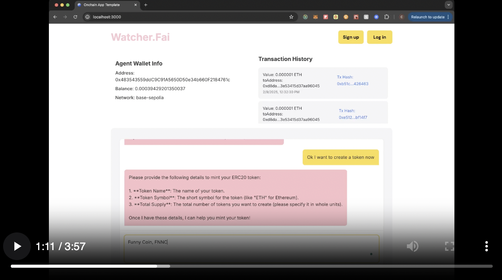

# Watcher.Fai
Watcher.Fai is your personal agentic assistant to help with your onchain interactions and your gateway to the world of web3. This assistant helps simplify complex interactions making web3 easier to access.

#### Watch the Demo:

<a href="public/agentshowcase.mp4" target="_blank">
  
</a>

## Tech Stack

- **Frontend**:
  - Next.js 14
  - React 18
  - TypeScript
  - Tailwind CSS
  - Wagmi for Web3 integration

- **Backend**:
  - Express.js server
  - LangChain for AI capabilities
  - AgentKit for blockchain interactions
  - CDP (Coinbase Developer Platform) integration
  - Alchemy

- **Blockchain**:
  - OnchainKit for Web3 functionality
  - Base Sepolia testnet support
  - WalletConnect for wallet connections

## Features

- Real-time transaction history
- Wallet integration
- AI-powered chat interface
- Blockchain interaction capabilities
- Secure authentication

## Setup

To ensure all components work seamlessly, set the following environment variables in your `.env` file using `.env.local.example` as a reference.

You can find the API key on the [Coinbase Developer Portal's OnchainKit page](https://portal.cdp.coinbase.com/products/onchainkit). If you don't have an account, you will need to create one. 

You can find your Wallet Connector project ID at [Wallet Connect](https://cloud.walletconnect.com).

```sh
# See https://portal.cdp.coinbase.com/products/onchainkit
NEXT_PUBLIC_CDP_API_KEY="GET_FROM_COINBASE_DEVELOPER_PLATFORM"

# See https://cloud.walletconnect.com
NEXT_PUBLIC_WC_PROJECT_ID="GET_FROM_WALLET_CONNECT"

ALCHEMY_API_KEY=""

OPENAI_API_KEY=""

```

## Local Development

```sh
# Install bun
curl -fsSL https://bun.sh/install | bash

# Install packages
bun i

# Run the development server
bun run dev
```

## Resources

- [OnchainKit documentation](https://onchainkit.xyz)
- We use the [OnchainKit Early Adopter](https://github.com/neodaoist/onchainkit-early-adopter) contract written by neodaoist [[X]](https://x.com/neodaoist)

## License

This project is licensed under the MIT License - see the [LICENSE](LICENSE) file for details.

## Need Help?

If you have any questions or need help, feel free to reach out to us on [Discord](https://discord.gg/8gW3h6w5) 
or open a [Github issue](https://github.com/coinbase/onchainkit/issues) or DMs us 
on X at [@onchainkit](https://x.com/onchainkit), [@zizzamia](https://x.com/zizzamia), [@fkpxls](https://x.com/fkpxls).